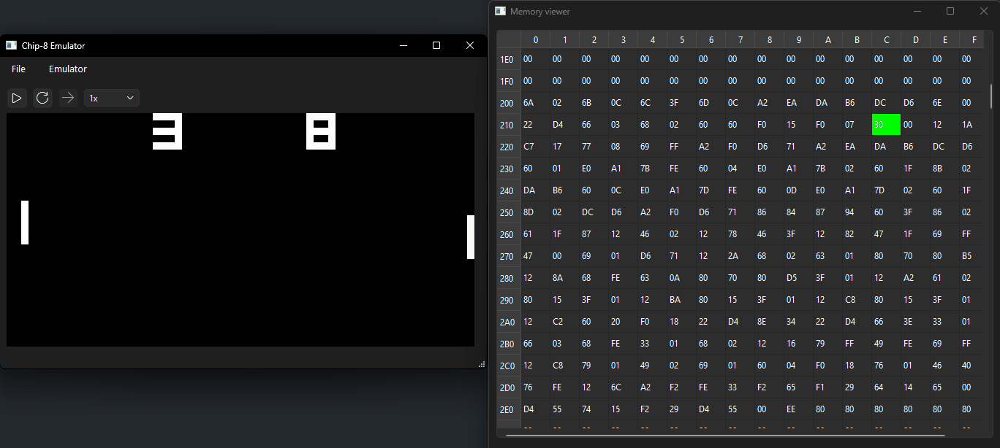

<div align="center">


A CHIP-8 emulator written in **C++17** using **Qt6 Widgets**.

Featuring emulation, save states, an integrated live memory viewer, emulator controls, and debugging tools.


<p>      </p>

**This project has reached end of development.**

</div>

## Demo

<p align="center">
  Pong running while the live memory viewer updates in real time.
  
  
</p>

<p align="center">
  <sup>GIF compression introduces ghosting artifacts that are not present in the emulator.</sup>
</p>

---

## Features

- CHIP-8 emulation
- Qt6 Widgets desktop interface
- Live memory viewer
- Live memory editing
- Save/Load game state
- Program Counter (PC) and Index Register (I) highlighting in memory viewer
- Play, Pause, Step, and Reset controls
- Adjustable execution speed (0.125×–4×)
- Sound emulation
- Recent ROMs menu

## Building

***Requirements***
- C++17 compiler
- Qt 6
- CMake 3.20+

```bash
git clone https://github.com/topilep/Chip8Emulator.git
cd Chip8Emulator

cmake -B build
cmake --build build
```
> [!TIP]
> Building the project with **Qt Creator** is recommended, since it automatically detects your Qt installation and configures CMake for you.

## Known limitations
- No configurable compatibility "quirks" (shift, load/store, jump behavior) yet — most ROMs run correctly, but a few may not match certain interpreters' exact behavior.
- SUPER-CHIP / XO-CHIP extended opcodes are not supported.
- No save states.

## Roadmap

- [x] Memory editing
- [ ] Mappable controls
- [ ] Compatibility quirks toggle
- [x] Save/load state
